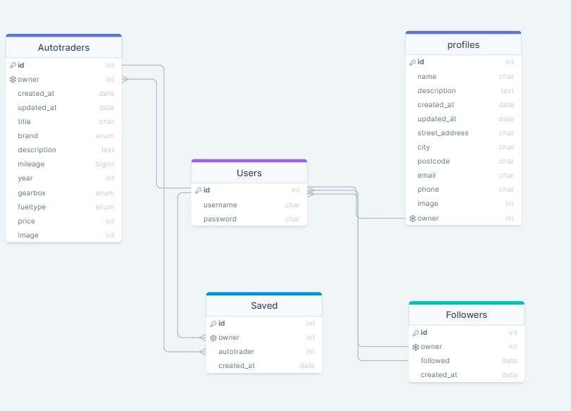

  <h1 style="font-size: 36px;">Autotrader API</h1>

 

* Autotrader is a vehicle marketplace platform designed for used cars, similar to CARSS. It provides a platform for users to create their own listings and sell their used cars.
  Additionally, users can search for used cars if they are looking to buy a car.The platform offers registration functionality, allowing users to access more features such as 
  saving their favorite cars and following car dealerships to stay updated on their latest inventory.

* The backend of Autotrader is powered by the Django REST framework. The API serves as the bridge between the frontend and the database, handling various functionalities. This 
  includes user authentication and authorization, management of user profiles and listings, and processing search queries. The API ensures seamless communication between the 
  frontend and the database, facilitating a smooth user experience on the Autotrader platform.

* In summary, Autotrader is a comprehensive vehicle marketplace platform that enables users to sell and buy used cars. It leverages the Django REST framework API to handle essential  
 functionalities and offers features such as user registration, saving favorite cars, and following car dealerships

 

[View the live project here](https://autotraderss-react.herokuapp.com/)

#### Links to the Frontend Project

 - [Frontend - Repository](https://github.com/SuzanDewitz/autotraderss-react-frontend)
 - [Frontend - Deployment](https://autotraderss-react.herokuapp.com/)

 

 ## Table of Contents

### [User Experience (UX)](#user-experience-ux)

- [User Stories](#user-stories)
- [Database Schema](#database-schema)
- [Features](#features)
     - [Future Features](#future-features)
- [Testing](#testing)
- [Validation](#validation)
     - [Bugs](#bugs)
     - [Fixed Bugs](#fixed-bugs)
     - [Remaining Bugs](#remaining-bugs)
- [Technologies Used](#technologies-used)
     - [Languages and Frameworks Used](#languages-and-frameworks-used)
     - [Python Modules Used](#python-modules-used)
     - [Packages Used](#packages-used)
     - [Programs and Tools Used](#programs-and-tools-used)
- [Deployment](#deployment)
    - [Forking the GitHub Repository](#forking-the-github-repository)
    - [Making a Local Clone](#making-a-local-clone)
    - [Deploying with Heroku](#deploying-with-heroku)
- [Credits](#credits)
     - [Code](#code)
     - [Acknowledgements](#acknowledgements)

 
 

# User Stories

- The primary objective of the API is to establish seamless communication between the backend and frontend components, enabling the fulfillment of user stories exclusively designed for the frontend aspect of the project. Below, you will find a comprehensive inventory of the user stories specifically tailored for the frontend:

1. Improve the user registration process by implementing a user-friendly interface with clear instructions and error handling.
2. Enhance the login functionality by incorporating additional security measures, such as two-factor authentication and password encryption.
3. Develop a visually appealing homepage that showcases the project's key features and provides easy access to relevant information.
4. Create an intuitive navigation menu that enables users to effortlessly browse through different sections and functionalities of the application.
5. Implement a search feature that allows users to quickly find specific content or items within the application.
6. Design an interactive dashboard that provides users with personalized insights, statistics, and notifications based on their preferences and activities.
7. Enable users to customize their profile by adding profile pictures, personal information, and preferences.
8. Build a robust messaging system that enables users to communicate with each other, facilitating seamless collaboration and information exchange.
9. Integrate social media sharing options to allow users to share their achievements, content, or experiences with their social networks.
10. Optimize the application's performance and loading times by implementing efficient caching mechanisms and minimizing unnecessary data transfers.
   
- Tasks were successfully implemented during the API development process. To track and manage these tasks, we utilized a Kanban board specific to the project. The Kanban board provides a visual 
  representation of the workflow, allowing us to monitor the progress of tasks and their respective stages. This board serves as a centralized location where you can find a comprehensive list of all the tasks associated with the API development.

 

  #### User stories for the backend can be found in a separate internal document [here](https://github.com/SuzanDewitz/autotraderss-drf-backend/blob/main/docs/userstories.md)
  #### Kanban board for the backend can be found in a separate internal document [here](https://github.com/users/SuzanDewitz/projects/1/views/3)
  #### Issues for the backend can be found in a separate internal document [here](https://github.com/SuzanDewitz/autotraderss-drf-backend/issues)

 

## Database Schema
+ The database schema depicted below served as the foundation for creating the project's database models.

 

## Future Features:

- Enhanced Search Options and Filters: Expand the search capabilities by incorporating additional options and filters based on various criteria.

- Buyer Rating System: Introduce a rating system to enable buyers to rate sellers, enhancing trust and credibility within the service.

- Location Algorithm: Implement an algorithm to facilitate location-based searches, enabling users to find cars and sellers within a specific distance.

- Image Gallery Functionality: Integrate an image gallery feature that empowers sellers to upload multiple pictures of the autotraders, providing a more comprehensive visual representation.

 
 

## Programs and Tools Used
 - [drawSQL](https://drawsql.app/) -  Used to create the Database Schema/ERD (Entity-Relationship Diagram) for the project.
 - [Gitpod](https://gitpod.io/workspaces) - Gitpod was utilized as the primary code editor for this project, providing a cloud-based development environment.
 - [Git](https://git-scm.com/) - Git was used for version control throughout the project. The terminal was utilized to commit changes to Git and push them to the project's repository.
 - [GitHub](https://github.com/) - GitHub served as the remote repository for storing the project's code after it was pushed from Git. It provided collaboration features, issue tracking, and a 
   centralized location for code hosting.

 

## Testing
- A separate document for testing can be found [here](https://github.com/SuzanDewitz/autotraderss-drf-backend/blob/main/docs/testing.md).

 

## Validation
#### Python Validation (PEP8)
 - All Python code was manually checked using CI Python Linter The Linter reports had messages about exceeding the string length of 79 characters, which have been fixed and blank lines. Re-testing did not reveal any errors. [CI Python Linter](https://pep8ci.herokuapp.com/) 
 - Settings.py and contact model, present some line too long warnings, ignored momentarily.

  

## Bugs

- settings.py error

### Fixed Bugs

 - settings.py no error

### Remaining Bugs
No known remaining bugs

 
 

## Technologies Used

#### Main Language Used:
   -  Python

#### Frameworks Libraries Used
 - Django: [Django](https://docs.djangoproject.com/en/3.2/)
 - Python: [Python](https://www.python.org/)
 - Django 3.2.14: [Django 3.2.14](https://pypi.org/project/Django/3.2.14/)
 - Django Rest Framework 3.14.0: [Django Rest Framework 3.14.0](https://pypi.org/project/djangorestframework/3.14.0/)

 

## Python Modules Used
- Built-in Packages/Modules
  + [pathlib](https://docs.python.org/3/library/pathlib.html)- Used to work with filepaths.
  + [os](https://docs.python.org/3/library/os.html) - Provides a portable way of using operating system-dependent functionality.

 

## Packages Used
- External Python Packages
   + [cloudinary](https://pypi.org/project/cloudinary/) - Integration with Cloudinary for handling cloud-based media storage.
   + [django-cloudinary-storage](https://pypi.org/project/django-cloudinary-storage/) - Integration with Cloudinary for storage backend in Django.
   + [dj-database-url](https://pypi.org/project/dj-database-url/) - Allows the use of 'DATABASE_URL' environmental variable in the Django project settings file to connect to a PostgreSQL database.
   + [django-allauth](https://pypi.org/project/django-allauth/) - Set of Django application used for account registration, management and authentication.
   + [dj-rest-auth](https://pypi.org/project/dj-rest-auth/) - API endpoints for handling authentication in Django Rest Framework.
   + [django-filter](https://pypi.org/project/django-filter/) - Application that enables dynamic QuerySet filtering based on URL parameters.
   + [djangorestframework-simplejwt](https://pypi.org/project/djangorestframework-simplejwt/) - JSON Web Token authentication backend for the Django REST Framework.
   + [django-cors-headers](https://pypi.org/project/django-cors-headers/) - Django app that adds Cross-Origin Resource Sharing (CORS) headers to responses.
   + [gunicorn](https://pypi.org/project/gunicorn/) - Python WSGI HTTP Server for hosting Django applications.
   + [Pillow](https://pypi.org/project/Pillow/) - Fork of PIL, the Python Imaging Library, providing image processing capabilities.
   + [psycopg2](https://pypi.org/project/psycopg2/) - Python PostgreSQL database adapter.
   + [python-dotenv](https://pypi.org/project/python-dotenv/) - Utility for setting key-value pairs from a .env file as environmental variables.

## Deployment
### Forking the GitHub Repository
1. Go to the project repository
2. In the right most top menu, click the "Fork" button.
3. There will now be a copy of the repository in your own GitHub account.

 

## Making a local clone
1. Go to the project repository
2. Click on the "Code" button.
3. Choose one of the three options (HTTPS, SSH or GitHub CLI) and then click copy.
4. Open the terminal in you IDE program.
5. Type git clone and paste the URL that was copied in step 3.
6. Press Enter and the local clone will be created.

 

## Alternatively by using Gitpod:
1. Go to the project repository
2. Click the green button that says "Gitpod" and the project will now open up in Gitpod.

 

## Deploy to Heroku

 #### The step i take Creating ElephantSQL

 - [Code Institute Guide](https://code-institute-students.github.io/deployment-docs/41-pp5-adv-fe/pp5-adv-fe-drf-01-create-a-database)

1. Log in to [ElephantSQL.com] (https://www.elephantsql.com/) to access your dashboard

  - Click “Create New Instance”

  - Set up your plan:

  - Give your plan a Name (this is commonly the name of the project)

  - Select the Tiny Turtle (Free) plan

  - You can leave the Tags field blank

  - Select “Select Region”

  - Click “Review”

  - Check your details are correct and then click “Create instance”

  - Return to the ElephantSQL dashboard and click on the database instance name for this project

  - In the URL section, click the copy icon to copy the database URL

 

2. Creating Heroku App

[Back to top](#top)

### Heroku Settings
- You will need to set your Environment Variables - this is a key step to ensuring your application is deployed properly.

1. In the Settings tab, click on Reveal Config Vars and set the following variables:
 + Key as ALLOWED_HOSTS and the value as the name of you project with '.herokuapp.com' appended to the end e.g. example-app.herokuapp.com. Click the Add button.
 + Key as CLOUDINARY_URL and the value as your cloudinary API Environment variable e.g. cloudinary://**************:**************@*********. Click the Add button.
  + Key as SECRET_KEY and the value as a complex string which will be used to provide cryptographic signing. The use of a secret key generator is recommended such as https://djecrety.ir. Click the Add button.
  + Ensure the key DATABASE_URL is already populated. This should have been created automatically by Heroku.
  + The DATABASE_URL should be copied into your local .env, created during the cloning process.
  + To make authenticated requests to this API (e.g. from a fontend application) you are required to add the key CLIENT_ORIGIN with the value set as the URL you will be sending the authentication request from.
   + Additionally, a CLIENT_ORIGIN_DEV key can be set with the value of a development server (IP or URL) for use during local development.

 

## Heroku Deployment
In the Deploy tab:
1. Connect your Heroku account to your Github Repository following these steps:
    + Click on the Deploy tab and choose Github-Connect to Github.
    + Enter the GitHub repository name and click on Search.
    + Choose the correct repository for your application and click on Connect.
2. You can then choose to deploy the project manually or automatically, automatic deployment will generate a new application every time you push a change to Github, whereas manual deployment requires you to push the Deploy Branch button whenever you want a change made.
3. Once you have chosen your deployment method and have clicked Deploy Branch your application will be built and you should now see the View button, click this to open your application.

 

###  The step i take Creating Heroku App

  - Log into [Heroku](https://dashboard.heroku.com/apps) and go to the "Dashboard"

  - Click “Create new app”
   
  - Give your app a name and select the region closest to you. When you’re done, click “Create app” to confirm.(autotraderss-drf-backend in my case)
  
  - Open the Settings tab, click " Reveal Convfig Vars"

  - Add a Config Var DATABASEURL, and for the value, paste your database URL from ElephantSQL (_do not add quotation marks)

  - In Gitpod workspace, to connect your external databas type command:

  - pip3 install dj_database_url==0.5.0 psycopg2

  - In settings.py underneath the import for os import dj_database:

            import dj_database_url

  - In settings.py update the detabase like so:

          import dj_database_url

  - In settings.py update the detabase like so:  

          Database
          https://docs.djangoproject.com/en/3.2/ref/settings/#databases

          if 'DEV' in os.environ:
            DATABASES = {
            'default': {
            'ENGINE': 'django.db.backends.sqlite3',
            'NAME': BASE_DIR / 'db.sqlite3',
            }
          }
         else:
          print("loading postgres ele")
            DATABASES = {
          'default': dj_database_url.parse(os.environ.get("DATABASE_URL"))
         }
    
         print('connected')

3. In env.py file, add a new environment variable to Gitpod with the key set to DATABASE_URL, and the value to your ElephantSQL database URL
import os

              os.environ['CLOUDINARY_URL'] = 'cloudinary://YOURLINK'

              # os.environ['DEV'] = '1'

             os.environ['DATABASE_URL'] = 'postgres://YOURLINK'

    

4. In the terminal make migrations:

            python3 manage.py makemigrations --dry-run
              python3 manage.py migrate
  
           Create a superuser for your new database

             python3 manage.py createsuperuser

##### Follow the steps to create your superuser username and password

5. To confirm that Database is connceted, on the ElephantSQL page on the left s select “BROWSER”

  - Click the Table queries button, select auth_user

   - Click “Execute”, you should see the superuser details. This confirms the tables have been created and you can add data to your database

   - In Gitpod teminal install gunicorn library:

           pip3 install gunicorn django-cors-headers

    - Update requirements.txt bit running command:

            pip freeze --local > requirements.txt

       - Add a Procfile to the top level of the directory and add the following code:
        release: python manage.py makemigrat

 

          release: python manage.py makemigrations && python manage.py migrate
             web: gunicorn autotraderss_drf_backend.wsgi

6. In settings.py update the value of the ALLOWED_HOSTS variable to include your Heroku app’s URL

                  ALLOWED_HOSTS = ['localhost', 'autotraderss-drf-backend.herokuapp.com']

 7. In settings.py inside INSTALLED_APPS add corsheaders:

                            'corsheaders',

 8. In settings.py at the top of MIDDLEWARE add corsheaders middleware

     
                    MIDDLEWARE = [
                      'corsheaders.middleware.CorsMiddleware',
                      'django.middleware.security.SecurityMiddleware',
                      'django.contrib.sessions.middleware.SessionMiddleware',
                      'django.middleware.common.CommonMiddleware',
                      'django.middleware.csrf.CsrfViewMiddleware',
                      'django.contrib.auth.middleware.AuthenticationMiddleware',
                      'django.contrib.messages.middleware.MessageMiddleware',
                      'django.middleware.clickjacking.XFrameOptionsMiddleware',
                      ]

 9. Under the MIDDLEWARE list, set the ALLOWED_ORIGINS for the network requests made to the server with the following code:

 10. In settings.py set allowed origins for network requests and enable cookies

                     if 'CLIENT_ORIGIN' in os.environ:
                      CORS_ALLOWED_ORIGINS = [
                     os.environ.get('CLIENT_ORIGIN')
                     ]

                    if 'CLIENT_ORIGIN_DEV' in os.environ:
                     extracted_url = re.match(r'^.+-', os.environ.get('CLIENT_ORIGIN_DEV', ''), re.IGNORECASE).group(0)
                      CORS_ALLOWED_ORIGIN_REGEXES = [
                       rf"{extracted_url}(eu|us)\d+\w\.gitpod\.io$",
                       ]

                     CORS_ALLOW_CREDENTIALS = True

  11. In settings.py et the JWT_AUTH_SAMESITE to 'None'. Without this the cookies would be blocked:

                    REST_USE_JWT = True
                    JWT_AUTH_SECURE = True
                    JWT_AUTH_COOKIE = 'my-app-auth'
                    JWT_AUTH_REFRESH_COOKIE = 'my-refresh-token'
                    JWT_AUTH_SAMESITE = 'None'

 12. In env.py, set SECRET_KEY value to a random value:

                  os.environ['SECRET_KEY'] = 'random value here'

 13. In settings.py, replace the default SECRET_KEY variable as follows:
 
                  SECRET_KEY = os.environ.get('SECRET_KEY')

 14. In settings.py, set DEBUG as follows:

                 DEBUG = 'DEV' in os.environ

 15. In Heroku settings, config vars, copy the CLOUDINARY_URL and SECRET_KEY values from env.py and paste them

 16. Add a config var COLLECT_STATIC and set to 1.

 17. In teminal update requirements.txt file with command

                pip freeze > requirements.txt

18. Add, commit and push changes.

19. In Heroku and click on 'Deploy' Tab. Go to 'Deployment Method' and click on GitHub.

20. Select and conect to the API repository.

21. In 'Manual Deploy' select Main branch and click 'Deploy Branch'.

22. Click on 'Open app' to access deployed app.  

23. In the drf_api views.py file, imort JWT_AUTH settings from settings.py:

### dj-rest-auth Credit C.I Wlakthrough

                 from .settings import (
                 JWT_AUTH_COOKIE, JWT_AUTH_REFRESH_COOKIE, JWT_AUTH_SAMESITE,
                 JWT_AUTH_SECURE,
                 )

### dj-rest-auth logout view fix

                    @api_view(['POST'])
                    def logout_route(request):
                      response = Response()
                      response.set_cookie(
                          key=JWT_AUTH_COOKIE,
                          value='',
                          httponly=True,
                          expires='Thu, 01 Jan 1970 00:00:00 GMT',
                          max_age=0,
                          samesite=JWT_AUTH_SAMESITE,
                          secure=JWT_AUTH_SECURE,
                       )
                     response.set_cookie(
                         key=JWT_AUTH_REFRESH_COOKIE,
                         value='',
                         httponly=True,
                         expires='Thu, 01 Jan 1970 00:00:00 GMT',
                         max_age=0,
                         samesite=JWT_AUTH_SAMESITE,
                         secure=JWT_AUTH_SECURE,
                     )
                    return response

24. In main urls.py file, import the logout_route:

                 from .views import root_route, logout_route
 
                     urlpatterns = [
                    path('dj-rest-auth/logout/', logout_route),
                    path('dj-rest-auth/', include('dj_rest_auth.urls')),

                    ]
 
 25. Add, commit and push changes.

 26. Return to Heroku and manually deploy branch again.  

## Credits

 ## Online resources

- [Django Documentation](https://docs.djangoproject.com/en/3.2/)

- [Django REST Documentation](https://www.django-rest-framework.org/)

- [Python Documentation](https://docs.python.org/3/)

 

## Code
 - Code Institute DRF Tutorial Project, used through as a basis for the creation of this API
   + CREDIT: Code Institute DRF-API Tutuorial Project
   + URL: https://github.com/Code-Institute-Solutions/drf-api

 

## Acknowledgements
- During the project setup and development, I extensively consulted the documentation provided by Code Institute, 
  including the Django Rest documentation and various Django functionality links. The resources provided valuable insights
  and guidance throughout the project.
- The Code Institute Slack community for their invaluable assistance and support throughout the course.
- I am grateful to the Code Institute tutors for their assistance during the setup process and for helping me resolve 
  version-related issues. Their explanations and suggestions were invaluable in overcoming the challenges I encountered.
- I would also like to express my heartfelt appreciation to my husband,<a href="#" style="color: blue; text-decoration:none;">
  Dietmar Dewitz</a>, for his unwavering support and guidance during the setup and delivery of the project.
  His assistance was instrumental in the successful completion of the project.

 

[Back to top](#top)

