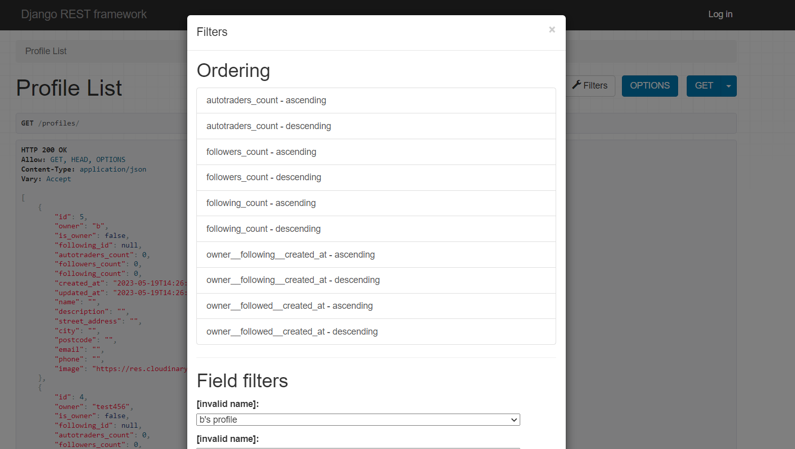

# Project Administration

## Administrative Tasks

- User management
- Access control and permissions
- Database backups and maintenance
- System monitoring and logging

## Procedures

### User Management

- Creating new user accounts
- Managing user roles and permissions
- Disabling or deleting user accounts

### Database Backups

- Performing regular database backups
- Storing backups in a secure location
- Testing the restoration process

### System Monitoring

- Monitoring system performance
- Analyzing logs for errors or issues
- Responding to system alerts
- 

