# API Testing

## Table of Contents
  - [Testing Endpoints](#testing-endpoints)
  - [Testing CRUD Functionality](#testing-crud-functionality)
    - [Save App](#save-app)
    - [Followers App](#followers-app)
    - [Profiles App](#profiles-app)
    - [Autotraders App](#autotraders-app)
- [Validating Code](#validating-code)

## Manual Testing
- All links were manually tested to check that they are being rendered as intended.
- The root route welcome message is being shown correctly.
- Users can login and log out from the app correctly.
- Throughout the development of the API, comprehensive manual testing was conducted to verify the functionality of various features. This involved actively 
  visiting each URL and meticulously examining the results to ensure accuracy and expected behavior based on the authorization state. Furthermore, thorough 
  testing was performed for critical operations such as item creation, updates, and deletions. By diligently carrying out these tests,
  we were able to identify and address any issues, thereby ensuring the robustness and reliability of the API.

### Testing Endpoints

| URL | Passed |
|---|---|
| root | :white_check_mark: |
| /saved/ | :white_check_mark: |
| /saved/\<id>/ | :white_check_mark: |
| /followers/ | :white_check_mark: |
| /followers/\<id>/ | :white_check_mark: |
| /profiles/ | :white_check_mark: |
| /profiles/\<id>/ | :white_check_mark: |
| /autotraders/ | :white_check_mark: |
| /autotraders/create | :white_check_mark: |
| /autotraders/\<id>/ | :white_check_mark: |

### Testing CRUD Functionality

#### Save App

| App | Action | Authenticated | Anonymous | Passed |
|---|---|---|---|---|
| Save | Read (List) | Array of owned objects | 403 Response | :white_check_mark: |
| Save | Read - Valid ID and Owner | Returns Detail | 404 Response | :white_check_mark: |
| Save | Read - Valid ID and not Owner | 404 Response | 404 Response | :white_check_mark: |
| Save | Read - Invalid ID | 404 Response | 404 Response  | :white_check_mark: |
| Save | Create | 201 Response | N/A | :white_check_mark: |
| Save | Update | N/A| N/A | N/A |
| Save | Delete | 204 Response | N/A | :white_check_mark: |

#### Followers App

| App | Action | Authenticated | Anonymous | Passed |
|---|---|---|---|---|
| Followers | Read (List) | Array of owned objects | Empty Results Array | :white_check_mark: |
| Followers | Read - Valid ID and Owner | Returns Detail | 403 Response | :white_check_mark: |
| Followers | Read - Valid ID and not Owner | 404 Response | 404 Response | :white_check_mark: |
| Followers | Read - Invalid ID | 404 Response | 404 Response  | :white_check_mark: |
| Followers | Create | 201 Response | N/A | :white_check_mark: |
| Followers | Update | N/A | N/A | N/A |
| Followers | Delete | 204 Response | N/A | :white_check_mark: |

#### Profiles App

| App | Action | Authenticated | Anonymous | Passed |
|---|---|---|---|---|
| Profiles | Read (List) | Array of profiles | Array of profiles | :white_check_mark: |
| Profiles | Read | Returns Detail | Returns Detail | :white_check_mark: |
| Profiles | Create | N/A | N/A | N/A |
| Profiles | Update | 200 Response | N/A | :white_check_mark: |

#### Autotraders App

| App | Action | Authenticated | Anonymous | Passed |
|---|---|---|---|---|
| Autotraders | Read (List) | Array of all autotraders | Array of all autotraders | :white_check_mark: |
| Autotraders | Read | Returns Detail | Returns Detail | :white_check_mark: |
| Autotraders | Create | 201 Response | N/A | :white_check_mark: |
| Autotraders | Update | 200 Response | N/A | :white_check_mark: |
| Autotraders | Delete | 204 Response | N/A | :white_check_mark: |

 

## Validating Code
- During the development of the project, the pycodestyle package played a crucial role in ensuring code quality. It was used to validate and fix any code-related issues consistently.
I'm pleased to report that in the final deployed version, there were no validation errors detected by pycodestyle.This highlights the commitment to maintaining clean and compliant code
throughout the development process.

 

   - settings.py error

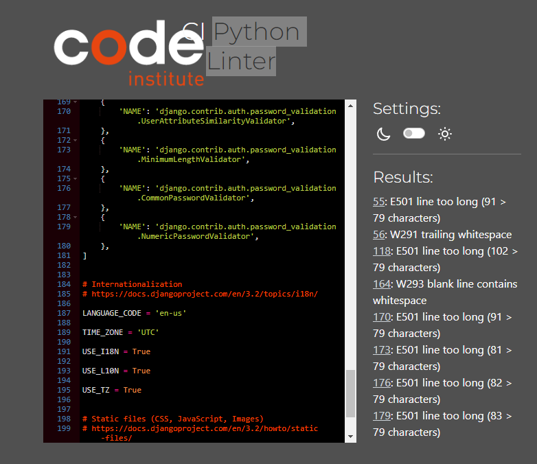

 

  - settings.py no error

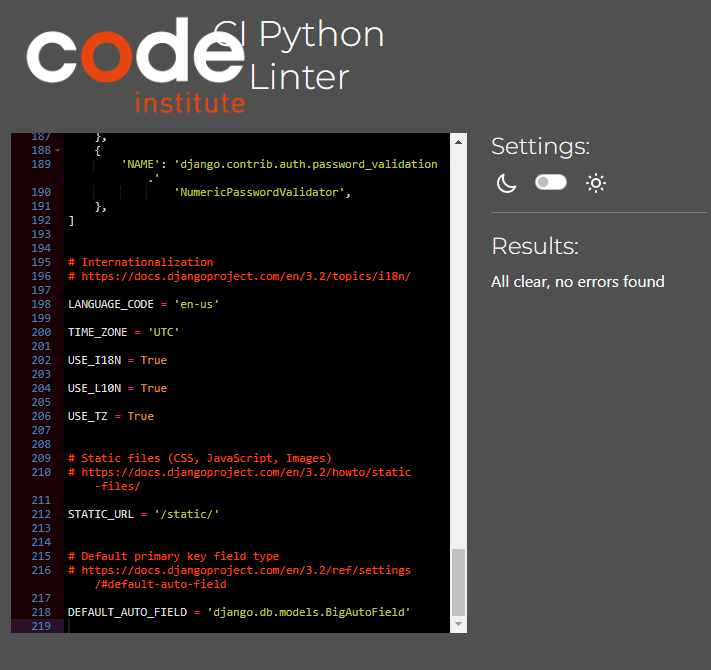

 

  - autotrader_dre_backend_url.py

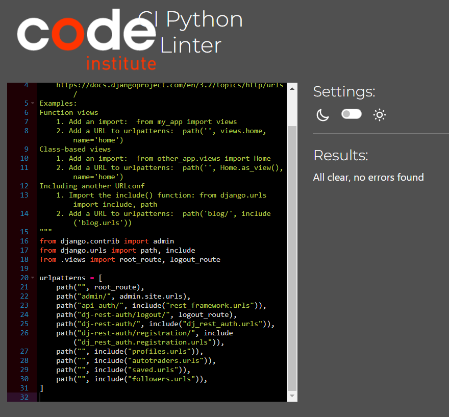

 
  
  
  - autotrader_dre_backend_views.py

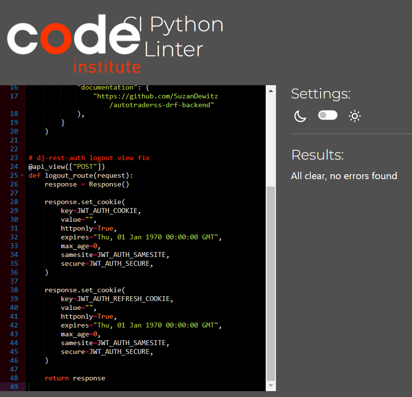

 

  - autotrader_models.py

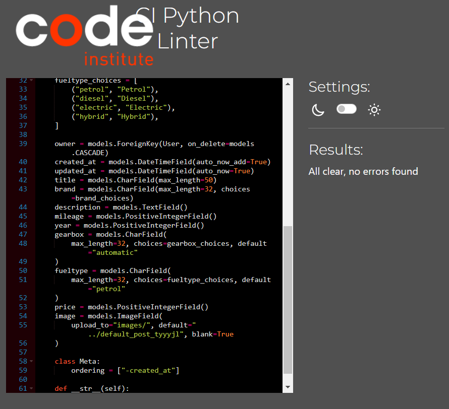

 

 - autotrader_serializers.py

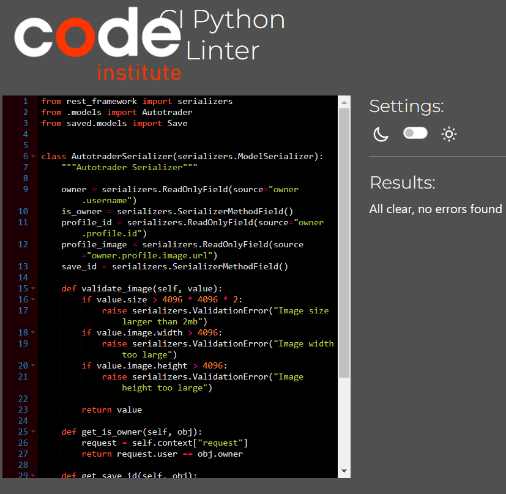

 

 - autotrader_views.py

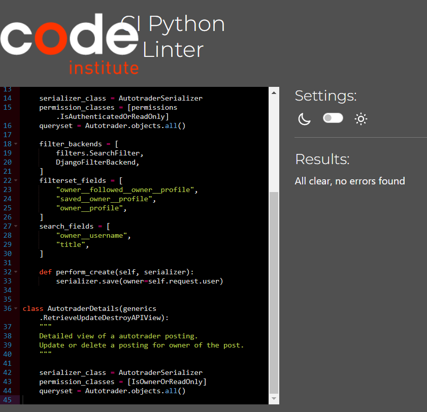

 

 - profiles_views.py

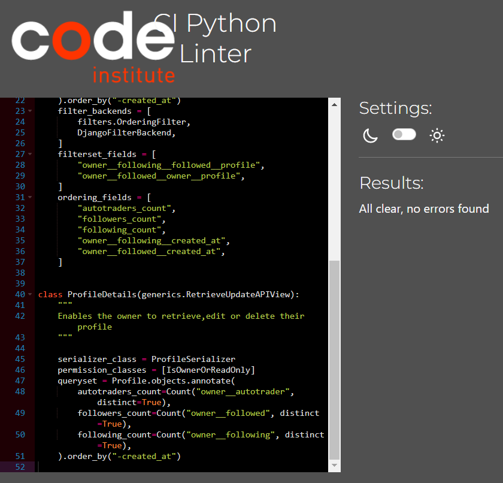

 

 - profiles_models.py

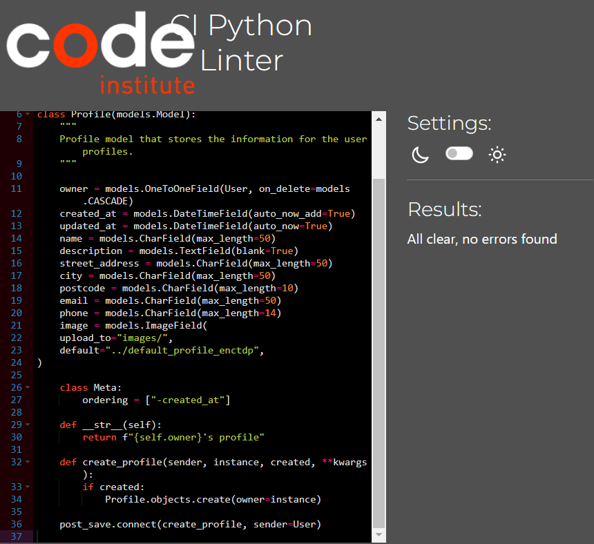

 

 - profiles_serializers.py

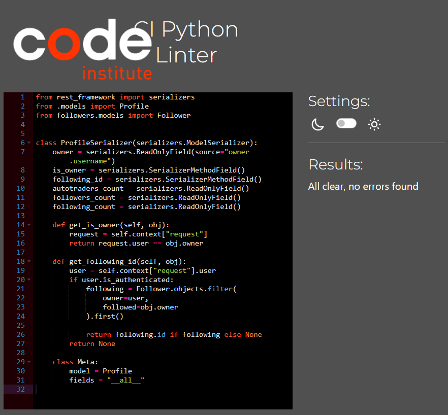

 

 - followers_views

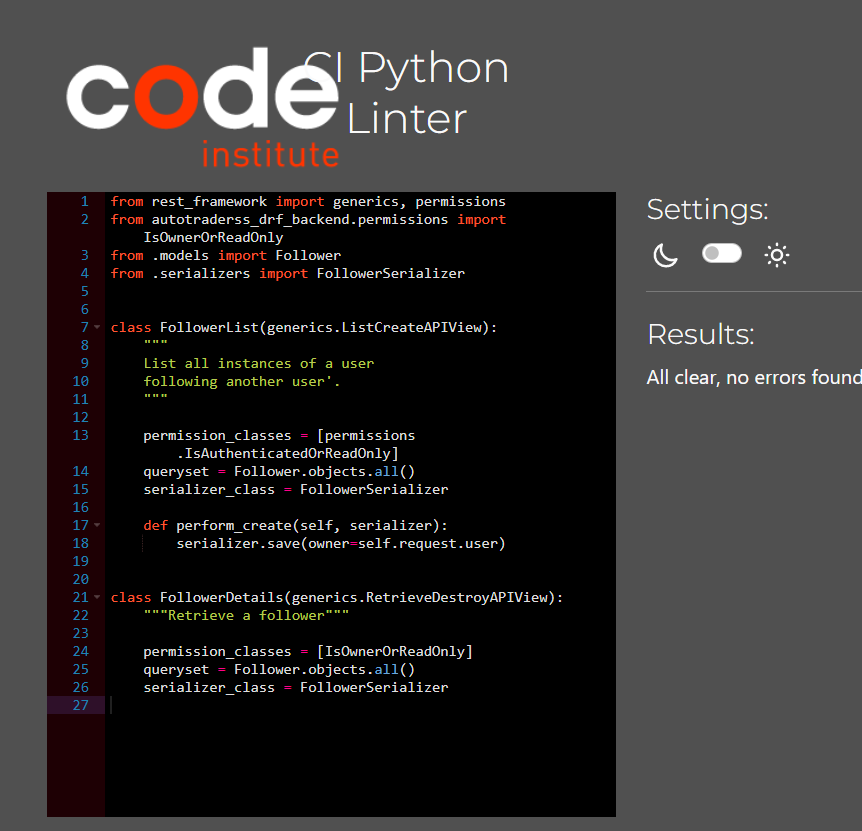

 

 - saved_views.py.

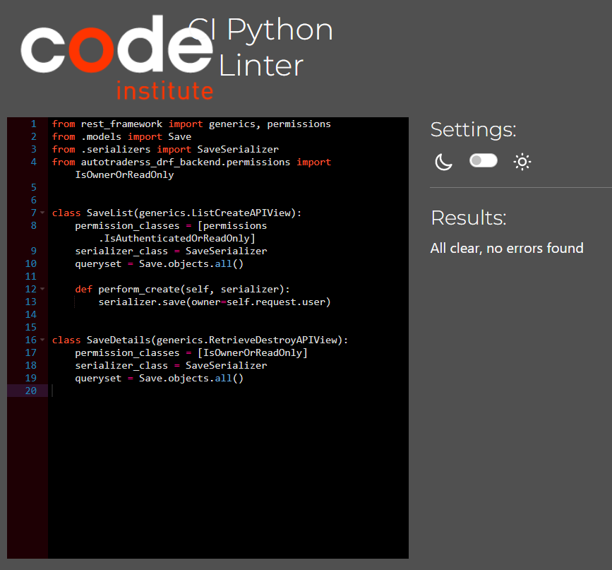

 

- followers_views.py

 

[Back to top](#top)